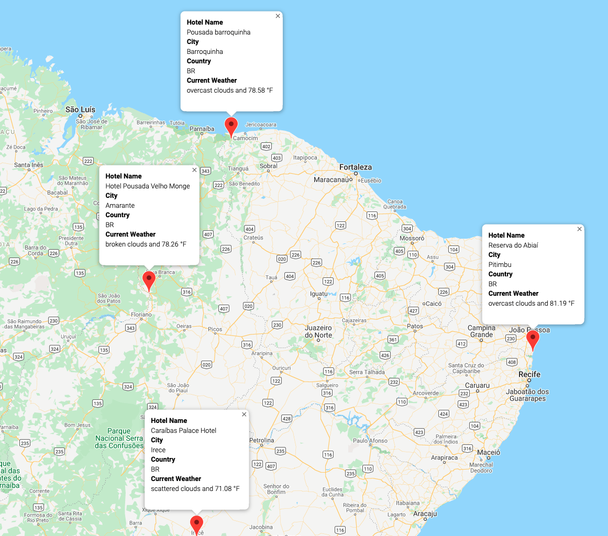

# World_Weather_Analysis
## Overview 
For our sixth analysis project, we learned to use APIs from within Jupyter Notebooks.  We created a list of 2000 coordinates using a random number generator and then used citipy to find cities close to our coordinates.  We searched Using Google Maps API.  We used OpenWeatherMap to populate our city list with weather information.  Using Google Map APIs, we were able to find a nearby hotel for each city, then plot tags for the cities on a google map directly in our Jupyter Notebook.  As well, we annotated our tags with the data we pulled from the weather map API calls.  Below are the images for our Vacation Search, and an itinary of 4 spots that were chosen based on desired temperatures.  
## Resources
- Data Sources: clean_students_complete.csv
                schools_complete.csv
- Software: 
    - Python 3.9.7, 
    - Visual Studio Code 1.63.2, 
    - Pandas 1.3.5, 
    - Jupyter Notebook 6.4.7, 
    - citipy 
    - OpenWeatherMap API
    - Google Maps API

## Vacation Search 
 

## Travel Itinerary 
Route:

 

Hotel Information:

 